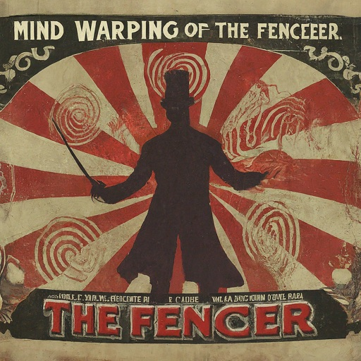

# Fencer
Fencer is a GUI app that allows users to create avar (v2) tables inside their variable fonts. These tables allow for more complex and expressive mappings between designspace locations and variable font instances. Use cases include:
* arbitrary distortion of the designspace, avoiding the need for additional masters and thus reducing font size;
* compact and practical parametric fonts;
* higher order interpolation (HOI) without duplicating axis names.

[**Launch Fencer**](https://lorp.github.io/fencer/src/fencer.html)

## UI Basics

The UI implements a windowing system, where you can drag and resize windows according to your preference. The windows are:
* **Settings window**, with:
	* a bank of sliders
	* a dropdown selector to choose whether one is editing the Current location or one of the Mappings
	* reset-to-default buttons (click resets input locations, shift-click resets output locations)
	* radio buttons to select X and Y axes in the Mappings window.
* **Mappings window**, where:
	* the dimensions of the 2D space are controlled by the radio buttons in the Controls panel (by default, the first axis in the font uses the X dimension of the display, the second axis in the font uses the Y dimension of the display)
	* the Mappings are displayed as green arrows in 2D space
	* you can add and delete Mappings, and drag them around
	* the Current location is displayed as a blue dot, with its mapped location as pale blue dot
	* you can drag the Current location around
	* the Instances are displayed as red dots, with their mapped locations as pale red dots
* **XML window**, where designspace-compatible XML is generated. This may be pasted into the \<axes\> element of a designspace file, that can be built using fontmake.
* **Renders window**, where the current instance is rendered, and the user can add more instances. All instances are updated whenever mappings are changed.

## What are Mappings?

Creating and previewing designspace mappings for a variable font is the core activity in Fencer. Each mapping consists of an input location and an output location, both of those locations being somewhere within the designspace of the font. In other words, in an _n_-axis font, each mapping has both its input and its output specified as locations on _n_ axes. The effect of a set of mappings is to transform the location of instances in designspace, which is useful for various use cases mentioned above.

Fencer displays each mapping as an arrow rendered in green, with handles so that the input and output locations can be dragged around.

As you edit the mappings, even by dragging a mapping handle a small amount, Fencer builds a new font file with a new avar2 table, and renders it in the Renders window. In order to help you understand the effect of mappings you are creating, Fencer also shows you live updates for:
* Each Named Instance location, shown in its untransformed and transformed locations, with an arrow between them, all rendered in red.
* Various other instances, untransformed and transformed, rendered in grey.
* The Current location, untransformed and transformed, rendered in blue.

## Exercise 1: fencing off a 2-D (wght, wdth) corner in Sofia Sans

Let’s try Fencer on the font that is preloaded, a custom build of [Sofia Sans](https://github.com/lettersoup/Sofia-Sans). This is a 2-axis font (Weight, Width) with the following simple 6-master structure and default at 400,100:

|          | wght=100 | wght=400 | wght=900 |
| ------    | ------   | ------   | -----    |
| wdth=100  | 100,100 | **400,100**  | 900,100 |
| wdth=62.5 | 100,62.5 | 400,62.5 | 900,62.5 |

_Note: The current shipping version of Sofia Sans uses a more complex master structure, since – without avar2 – the design space requires additional “synthetic” masters to represent the designer’s intentions. The avar2 mappings allow us to avoid the additional masters, and thus reduce font size and simplify maintenance._

As is common in 2-axis wght/wdth fonts, the Bold Extra Condensed instance (900,62.5) is too heavy for the designer’s taste. We will use Fencer to create a rectangular region near max Weight and min Width that is not accessible, effectively “fencing off” the corner.

To do so requires FIVE mappings. Let’s add them one by one:

1. Click the “Add mapping” button to add the first mapping:
   * A mapping is added at the current location.
   * Set the Input location (the base of the green arrow) to 900,62.5 by dragging the mapping handle to the bottom right corner. It will help to turn on the “snap to integers” checkbox.
   * Set the Output location (the tip of the green arrow) to 700,62.5.
   * (Note that you can also use the sliders, or edit the XML directly to reposition mappings.)
   * This mapping is defining the bottom of the rectangular fenced region.
   * At this stage, notice that various grey and red arrows have appeared, indicating how the designspace is being distorted by this mapping. Also try moving the blue Current location handle to see how the mapping affect it.
   * Notice that, while this mapping fixes the problem at 900,62.5 by making that instance lighter, it also affects all instances along that Width axes. In practice, we probably want to stop the effect at, say, Weight 700.

2. Add another mapping:
   * Set the Input location to 700,62.5.
   * Set the Output location to 700,62.5.
   * This kind of mapping, where the Input and Output are identical, we call a Pin, as it’s intended to block the effect of another mapping nearby.
   * Notice how the red and grey arrows have changed, and how the instances at Width=62.5 are working well. When a user has Width at 62.5, and increases Weight from default=400, at first it will behave as before, but there comes a point, at Weight=700, where the font refuses to become any heavier.
   * Still, notice that the area above Width=62.5 is being distorted undesirably.
   
3. Add another mapping:
   * Set the Input location to 900,70.
   * Set the Output location to 700,70.
   * This mapping is defining the top of the rectangular fenced region.

4. Add another mapping:
   * Set the Input location to 700,70.
   * Set the Output location to 700,70.
   * Notice that this is another Pin mapping.
   * Now things are looking pretty good! We have set up a rectanglar region in the bottom right of the designspace, where anything inside it is moved to the left edge. We have successfully “fenced off” this zone. Move the Current location handle around to see how it works. Notice that the area above Width=70 is still being distorted, however, which is probably not what we want.

5. Add one final mapping:
   * Set the Input location to 900,71 (71 being a value very close to 70).
   * Set the Output location to 900,71.
   * Notice that this is another Pin mapping.
   * What we’ve done here is to block the effect of the 3rd mapping, so that the area above Width=70 is no longer distorted.
   * Move the Current location handle around, to see how things are. Great, huh?!

_One more thing:_ There is in fact one additional subtlety, which you may have noticed already, which is what happens between Width=70 and Width=71. At maximum Weight, move the Current location handle very slowly up and down, around Width=70, going in and out of the rectangular fenced off zone. You’ll see that the transformed Weight value interpolates between 900 and 700 as Width is moved gradually from 71 to 70. This “soft fence” may indeed be what we want — but it may not be. If you want a “hard fence” at Width=70, thus a jump from 900 to 700 in transformed Weight as we cross the fence, we need to adjust that “close” value of 71 to be a very small amount above 70, an amount we call epsilon. Epsilon is determined by the axis extents and the underlying granularity of internal variation math. In this case, epsilon is (100 - 62.5) / 16384 = 0.00228881835, so the value we’ll use is 70.00228881835. Update the 5th mapping to use this value, and you’ll see that the fence is now hard.

## Exercise 2: fencing off a 2-D (wght, wdth) corner in Sofia Sans another way

Redo the above exercise with the same rectanuglar zone. But this time, instead of using mappings to reduce Weight to solve the problem at the corner, use mappings to increase Width. In other words, your mappings (specifically, those that are not Pin mappings) should be arrows that point _up_ rather than _left_. Use the same number of mappings. Consider the benefits of this approach compared with the previous one.

## Trying your own fonts in Fencer

Drop your TTF onto the blue area in the Settings window.

For best results, use a font without an avar table, since Fencer will overwrite any existing avar table.

## Testing fonts made by Fencer

Click “Download font” to get a copy of the latest font build.

When you are happy with the results, then instead of using the font made by Fencer directly, it is recommended to copy the XML from the XML window into the \<axes\> element of a designspace file, and compile using fontmake.

## References

* [avar v2 specification](https://github.com/harfbuzz/boring-expansion-spec/blob/main/avar2.md)
* [avar v2 intro video](https://www.youtube.com/watch?v=j7unMVZOcaw) and [slides](https://docs.google.com/presentation/d/1i8CEqHkVR4oAZKjU_BqtzzrOx2lAfDDjwkAgzlEGjuo/) (October 2022) by Laurence Penney & Dave Crossland
* [designspaceLib: Document XML structure: \<mappings\> element](https://fonttools.readthedocs.io/en/latest/designspaceLib/xml.html#mappings-element)